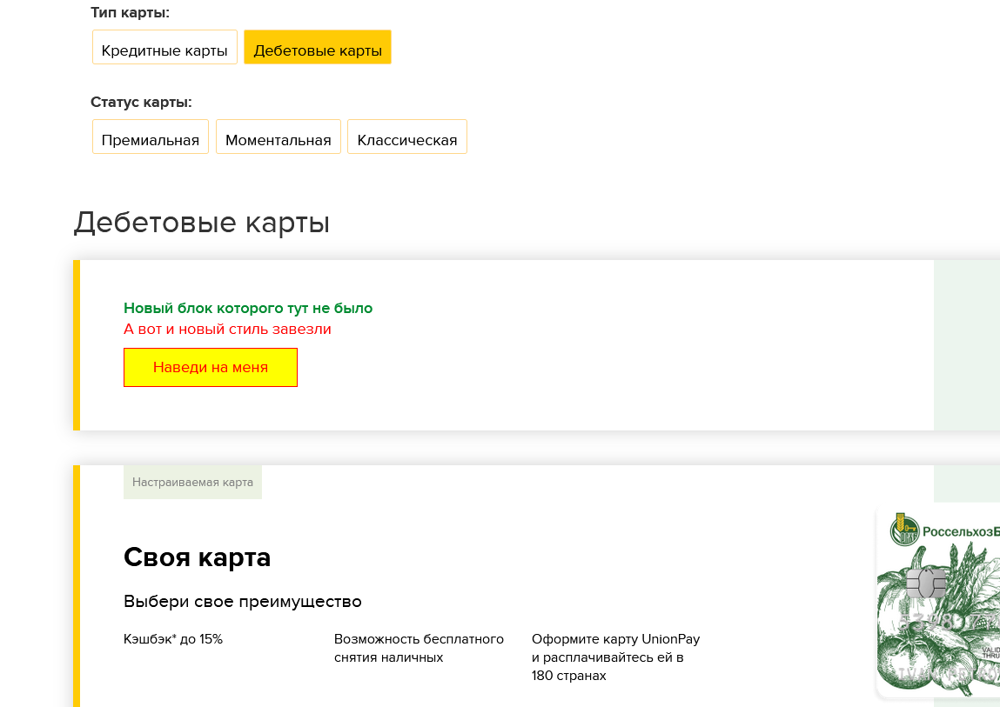

Подход к верстке в окружении текущего шаблона.

Что предлагается: 

1. Скачиваем страницу, для которой планируются изменения, например https://www.rshb.ru/natural/cards/

Делать это, как мне кажется, лучше через wget:

```
./wget.exe --convert-links --adjust-extension --page-requisites --no-parent --load-cookies=cook  --save-cookies=cook --keep-session-cookies --user-agent="Mozilla/5.0 (Windows NT 10.0; Win64; x64) AppleWebKit/537.36 (KHTML, like Gecko) Chrome/104.0.0.0 Safari/537.36" http://www.rshb.ru/natural/cards/
```

(так я и скачал код, который в данном репозитории лежит)

2. Закидываем под гит

3. Начинаем вносить свои правки

Файл который надо править лежит в /natural/cards/

4. После того, как работа закончена коммитим изменения и пушим в гит.

Таким образом мы сможем видеть какие [изменения](https://github.com/AndreyVorozhko/rshb-front-test/commit/a4277a8e9c6f230b64b43717b52ee8ef3a2f2438) были внесены и повторить их на текущем проекте. Например, в данном примере я добавил вот такой блок:



Особенности:

1. Внимание - лучше не править оригинальные стили, а переопределять свои. То же самое и с JS. И лучше делать как в примере - подключать свои кастомные файлы для стилей и JS.

2. Говнокод на скачанных страницах выпрямлять нельзя - так как в коммите будет непонятно какие были произведены изменения, кроме того, он может генериться из компонентов, поэтому пользы от этого никакой.

3. Скачивание страниц нужно закидывать в отдельный коммит

4. Отдельную задачу лучше делать в отдельной ветке и определиться с неймингом, по стандарту "feature/что-было-сделано". Поэтому лучше подойдет гитлаб.

5. Подход надо обкатать, может что-нибудь вылезти еще, что мы пока не видим.
